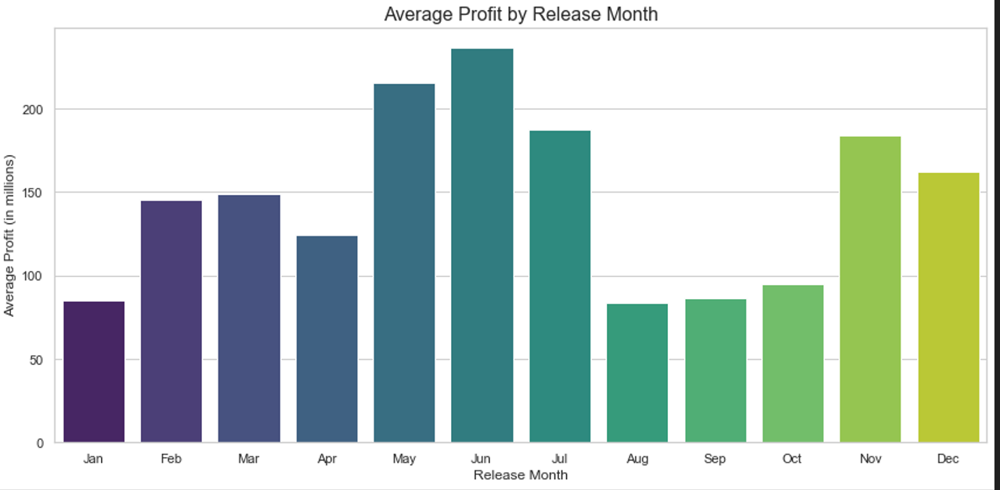
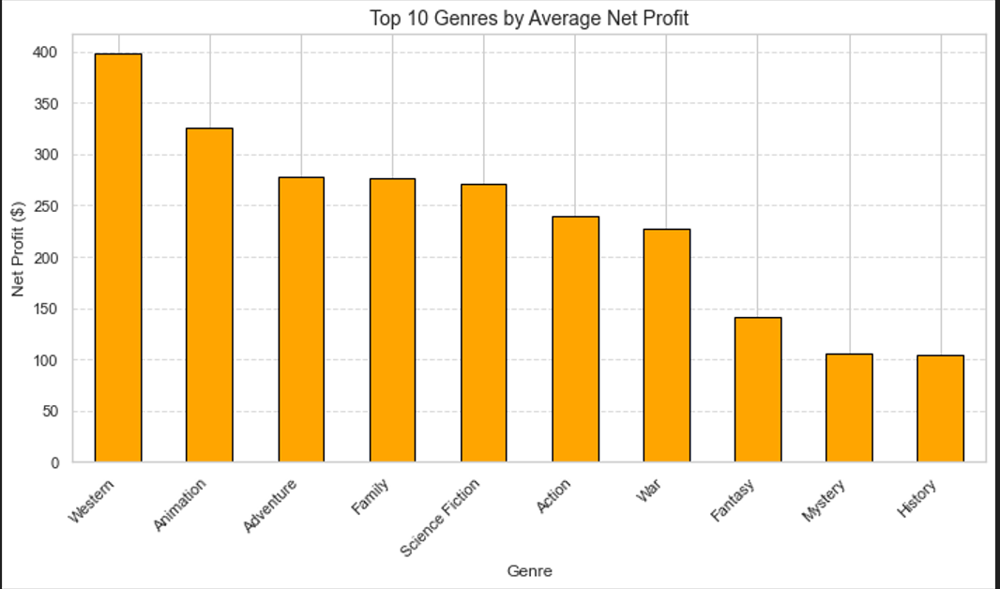
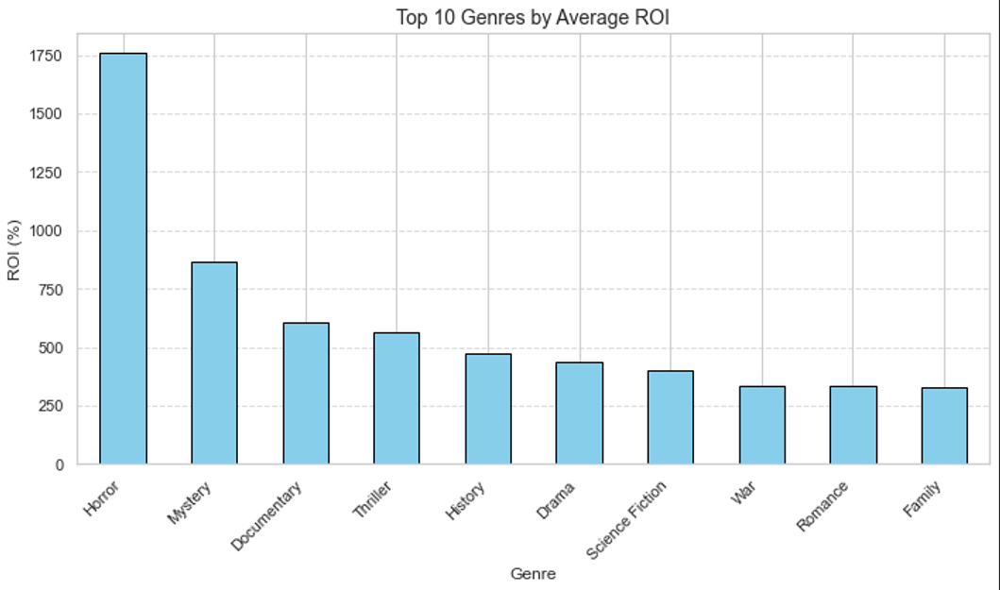
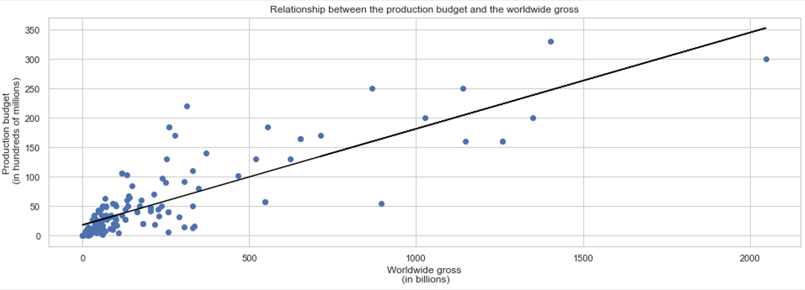
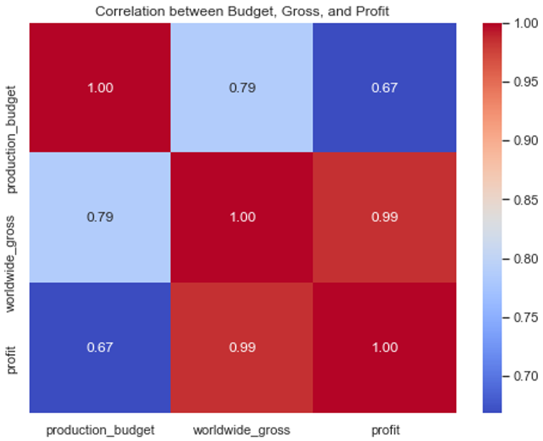
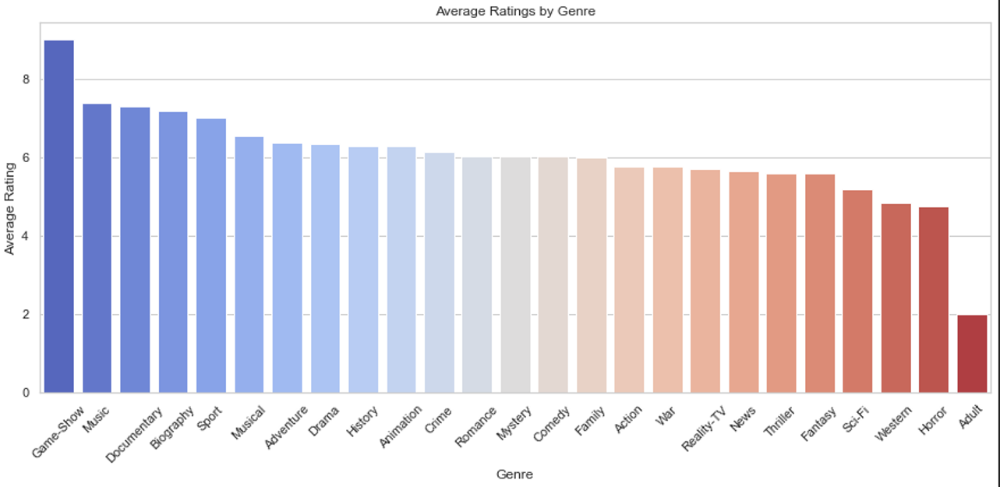
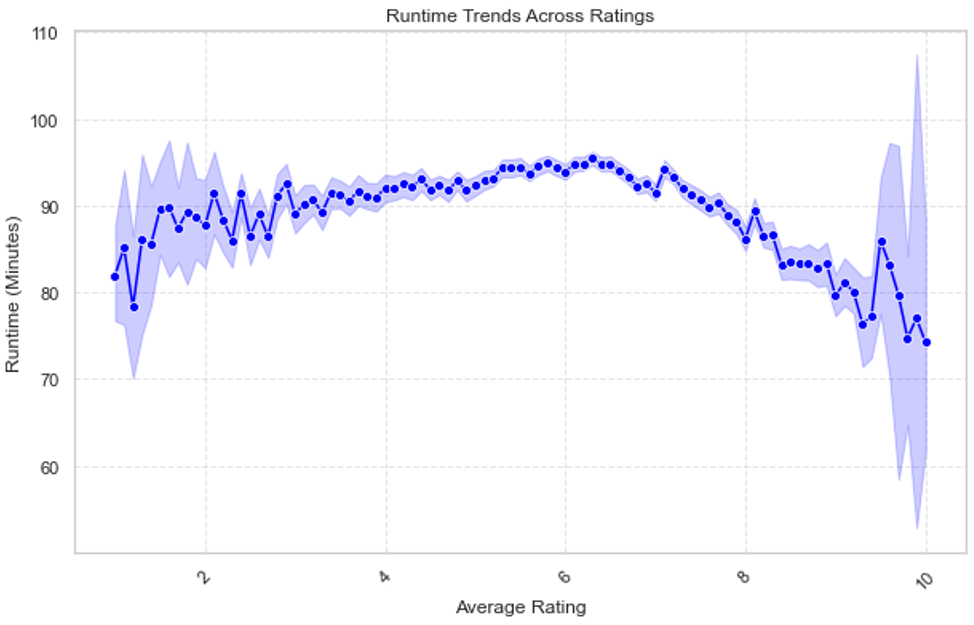

# Analyzing Movie Industry: Trends and Insights for a New Movie Studio

## Authors
Ian Bett, Wambui Kamotho, Felista Kiptoo, Trevor Maina, Habshi Pedro

---

## Project Overview
This project aims to guide the establishment of a new movie studio by providing actionable insights into the key factors driving box office success. By analyzing data from IMDB, The Movie Database (TMDb), and The Numbers, the study identifies profitable genres, optimal budgets, effective release timings, and ideal movie characteristics such as runtime. The findings offer strategic recommendations to ensure financial success and audience engagement in the highly competitive movie industry.

---

## Business Problem
The new movie studio lacks experience in filmmaking and needs insights to:
- Identify successful movie characteristics.
- Pinpoint profitable genres.
- Determine optimal budget ranges.
- Strategize release timings to maximize box office revenue.

---

## Data Analysis Questions
1. **How does release timing (e.g., month) affect box office success?**
   - Identify the most profitable months for movie releases.
2. **Which genres have the highest ROI and profit?**
   - Highlight the genres delivering the best financial performance.
3. **What is the realistic budget cost amount to consider?**
   - Inform optimal financial investment levels for movies.
4. **Which genres have the highest average rating?**
   - Focus on producing quality films that resonate with audiences.
5. **What is the appropriate movie length based on average ratings?**
   - Determine runtimes most likely to achieve high audience reception.

---

## Data Understanding
### Data Sources
The project uses data from:

1. **IMDB (im.db SQLite database):**
   - `movie_basics`: Titles, genres, runtime, and production years.
   - `movie_ratings`: Audience and critic average ratings.

2. **The Movie Database (TMDb):**
   - Metadata such as genres, movie titles, release dates, and vote counts.

3. **The Numbers:**
   - Box office data, including production budgets and worldwide gross revenues.

---
### Key Variables
#### Categorical Variables
- **Genres**: Multi-label field (e.g., "Action, Adventure").
- **Release Timing**: Month or season of release.

#### Numerical Variables
- **Production Budget**: Continuous variable reflecting investment levels.
- **Box Office Revenue**: Continuous variable representing financial success.
- **Ratings**: Continuous variable (range: 1-10) capturing audience and critic reception.

#### Time Variables
- **Release Year/Month**: Used to identify trends and seasonality.


---


## Data Analysis Process
1. Explore the structure of the `im.db` SQL database, focusing on `movie_basics` and `movie_ratings` tables.
2. Integrate box office data from The Numbers and TMDb.
3. Preprocess variables, handle missing values and transform fields (e.g., splitting multi-label genres).
4. Perform statistical analysis and data visualization to uncover insights.


#### Tools and Methods  
- **Data Processing**: Used **pandas** to clean, filter, join, aggregate, and analyze the datasets effectively.  
- **Visualization**: Employed **Matplotlib** and **Seaborn** to create clear and impactful visualizations tailored for non-technical stakeholders. Review the notebook for detailed processes.

These analyses laid the groundwork for actionable recommendations, ensuring that the business's venture to  is based on robust, data-driven insights.


## Data Analysis Results

  
To address these questions I had posed at the onset of this project, various bar charts, scatter plots, and graphs were used to uncover patterns and provide actionable insights:  


  ###  1. **Average Profit by Release Month**: 
  - We visualized the most profitable months to release a movie by averaging the profit amounts in each month. 



#### Insights
   - Release movies during peak seasons such as summer and the holiday months to maximize box office success. Summer: June and July Winter: December 
      
          
   ###  2. **Top 10 Genres by Average Net Profit**
   
   -We identified the top 10 genres that yield a higher net profit.
   


#### Insights
  - Prioritize making movies of genres such as Western, Animation, Adventure, Family, and Science Fiction that yield a higher profit.
      
 
   ###   3. **Top 10 Genres by Average ROI**
   -We identified the top 10 genres that yield a higher net profit.
   


#### Insights
   - Consider making movies of genres such as Horror that yield a higher ROI.
  
  
   ###   4. **Relationship between the production budget and the worldwide gross**
   - Explored the Relationship between the production budget and the worldwide gross
   




#### Insights
   - Strategically allocate production budgets within a range that balances profitability and risk. For example, Consider a budget range of 50 to 100 million dollars.
   - Correlation coefficient: 0.786
This indicates a strong positive relationship. Higher production budgets are generally associated with higher worldwide gross revenues.
   
 
  ###      5. **Average Rating by Genre**
  - We visualized the genres that have a higher audience rating.
   


#### Insights
  - Consider making movies of genres such as game shows and adventure that have a Rating between 6 - 10.
   
   
   ###     6. **Runtime Trends Across Ratings**
   - We visualized the average ratings by Run time minutes.
   


#### Insights
  - Consider making movies of length between 90 - 120 minutes
   
   
   
   
   
---

## Recommendations
1. **Focus on Profitable Genres:**
   - Prioritize Western, Animation, Adventure, Family, and Science Fiction genres.
2. **Strategic Budgeting:**
   - Maintain production budgets within $50M to $100M to balance profitability and risk.
3. **Optimal Release Timing:**
   - Target high-demand seasons:
     - **Summer**: June, July
     - **Winter Holidays**: December
4. **Ideal Runtime:**
   - Create films with 90-120 minutes runtimes to align with audience preferences.
5. **Quality Focus:**
   - Use audience rating insights to create engaging films, ensuring long-term loyalty and studio reputation.

---

## Limitations and Next Steps
### Limitations
1. **Data Gaps:**
   - Missing or incomplete information on budgets and revenues.
2. **Historical Bias:**
   - Analysis based on historical data, which may not reflect emerging trends.
3. **Multilabel Genres:**
   - Movies with multiple genres may dilute genre-specific insights.

### Next Steps
1. **Enhance Data Quality:**
   - Address missing data and adjust for inflation.
2. **Expand Metrics:**
   - Include marketing and promotional data.
3. **Regional Trends:**
   - Analyze regional box office performance.
4. **Streaming Impact:**
   - Explore the effects of streaming platforms on profitability.
5. **Predictive Modeling:**
   - Build machine learning models to forecast box office success.
   
---


# Repository Structure
```
Movie-Analysis-Phase-2-Project/
│
├── images/                    # Directory containing project-related images
│   ├── A.PNG                  # Added images (e.g., plots, diagrams)
│   ├── B.PNG
│   ├── C.PNG
│   ├── D.PNG
│   ├── E.PNG
│   ├── F.PNG
│   └── G.PNG
│
├── zippedData/                # Directory containing zipped data files
│   └── im.db                  # SQLite database with movie-related data
│
├── .gitignore                 # Git configuration to ignore specific files
├── README.md                  # Project overview and documentation
├── dsc-phase2-project.ipynb   # Jupyter notebook for project analysis
├── Presentation.pdf           # PDF presentation of the project
└── Notebook.pdf               # PDF version of the notebook
```


